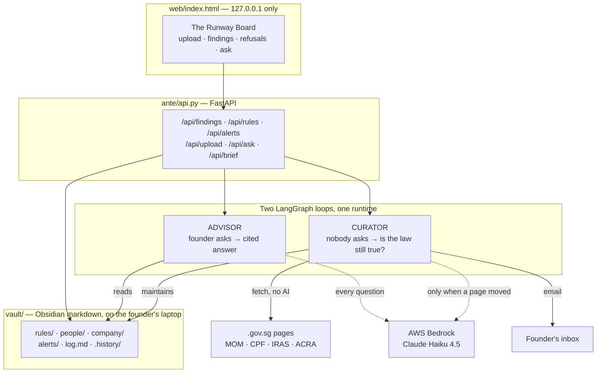

# Ante

**Regulatory early warning for Singapore startup founders.**
The law moves. Your company moves. Ante notices which one just made you non-compliant, tells
you what it costs, and proves every figure against the government page it came from.

> SimplifyNext **IGNITE Agentic AI Hackathon 2026** · Digital track
> Python 3.13 · LangGraph · AWS Bedrock (Claude Haiku 4.5) · FastAPI

---

## Table of contents

| | |
|---|---|
| [1. The problem](#1-the-problem) | Who is stuck, and why it costs money |
| [2. What Ante does](#2-what-ante-does) | The solution in one page |
| [3. Why this needs agentic AI](#3-why-this-needs-agentic-ai) | The question a judge should ask |
| [4. Quickstart](#4-quickstart) | Running it in three minutes |
| [5. Using it through the website](#5-using-it-through-the-website) | The demo path, click by click |
| [6. Architecture](#6-architecture) | One vault, two loops, three clocks, four tiers |
| [7. Every file, and what it is for](#7-every-file-and-what-it-is-for) | The code map |
| [8. The guarantee](#8-the-guarantee-ante-cannot-invent-a-figure) | Five gates, and the negative test |
| [9. Metrics](#9-metrics) | The six published numbers, measured |
| [10. Testing and evaluation](#10-testing-and-evaluation) | Six self-checks, no network needed |
| [11. Design](#11-design) | Why it looks like a newspaper |
| [12. Benefits](#12-benefits) | What it is worth |
| [13. What Ante refuses to do](#13-what-ante-refuses-to-do) | The boundaries, enforced in code |
| [14. Roadmap](#14-roadmap) | Where it goes next |

---

## 1. The problem

> **A founder of a 10-to-50 person Singapore startup with no HR or finance hire needs a way
> to find out that a threshold has moved *before* it costs them, because the obligations that
> hurt most are the ones that changed quietly while they were busy building.**

Three separate clocks can make a compliant company non-compliant overnight, and **none of
them sends you a letter**:

| Clock | What moves | Example, live in the demo vault |
|---|---|---|
| **The law moved** | A government figure changes | CPF Ordinary Wage ceiling rose S$7,400 → S$8,000 on 1 Jan 2026 |
| **You grew** | You crossed a threshold | Revenue passes S$1m and GST registration becomes compulsory |
| **A date arrived** | A recurring deadline lands | ACRA annual return, due 7 months after financial year end |

The expensive category is the first one, and specifically **obligations already in force**.
A calendar app structurally cannot warn you about these: the date is in the *past*. In the
demo vault, one employee has been over the CPF ceiling for **248 days** — a cost incurred
every month since January that nobody has noticed.

**Evidence.** Every rule in the vault is transcribed from a primary `.gov.sg` page, cited
in the note, and re-checked daily — see [`vault/rules/`](vault/rules). The regulatory facts
are verifiable today.

**And the structure of the rules predicts the miss.** None of the three clocks is announced
to the company it binds. Two of them — the law moving, and a date arriving on an obligation
already in force — leave no trace in any calendar the founder keeps, because by the time the
obligation exists there is nothing left to schedule. The 248-day exposure above was not caused
by carelessness. It is what the system produces by default.

**This statement survives a different solution.** It names a person, a moment and a cost,
and it would still be true if someone built a spreadsheet, a Slack bot, or nothing at all.

---

## 2. What Ante does

A founder uploads a payroll CSV and answers four questions. Ante builds an **Obsidian-readable
markdown vault on their own laptop**, joins their roster against a curated Singapore rule base,
and shows exactly who is on the wrong side of what — with the dollar figure, the date, and a
one-click path to the government page it came from.

Then it keeps watching. Every morning it re-reads the source pages. When a figure moves, it
rewrites the rule **by itself** — but only after proving in Python that the new number is
literally printed on the page. When it cannot prove that, it refuses, and escalates to a human.

Three properties that are the whole point:

1. **Every figure is traceable.** Not "the AI says S$3,600" — the sentence from `mom.gov.sg`,
   the date a person last read it, and the date the machine last confirmed it, all on screen.
2. **Your payroll never leaves your laptop.** The server binds `127.0.0.1`. The only thing
   that crosses the wire is the text of a government page. Employee data is never sent to a model.
3. **It prices what it can compute, and quotes the rest.** Two of the six demo findings compute
   their cost from your own payroll, to the dollar. The other four carry a human-written price,
   quoted verbatim and attributed — because an employer CPF rate is not in the vault, and a
   figure Ante cannot derive is a figure Ante will not invent.

---

## 3. Why this needs agentic AI

> *"Would this problem still exist if agentic AI had never been invented?"* — Yes. Which is why
> §1 names no technology. Here is why an agent earns its place in the **solution**.

**A fixed workflow cannot do this**, because the input is the open web and the failure mode is
silence:

| What a cron script would do | What the agent does |
|---|---|
| Diff the whole page → fires on cookie banners, footers, reflowed sentences | Hashes only the ±2000 characters around **this rule's own keywords** |
| Regex the new number → breaks the first time MOM writes "3,600" instead of "$3600" | A model *reads* the changed region and reports what moved, in natural language |
| Write whatever it extracted | The model gets **no write tool**. It returns a `Verdict`; Python decides |
| Crash when the page is JS-rendered | Returns `unverifiable`, raises an alert, and keeps the stale snapshot so tomorrow tries again |

**Planning, acting, adapting** — the three the rubric asks us to name:

- **Plans** — the advisor decides which rules to read and which roster rows to scan, then
  batches its tool calls; the curator fans out over every rule in parallel with `Send`.
- **Acts** — it writes to the rule base unattended, raises alerts, and emails the founder.
- **Adapts** — a changed page routes to Bedrock; an unchanged one never constructs the model
  at all. Credentials expiring mid-run checkpoints and resumes where it stopped.

**And the LLM is deliberately kept out of two decisions**, because both are arithmetic and must
never vary between runs:

- *Who is non-compliant* — each rule declares `bites: below|above|band|forecast|always`, and
  Python does the comparison ([`vault.exposure()`](vault.py)).
- *Which CSV column is the salary* — a deterministic alias table, not a model call.

The model explains, prices and prioritises. **Python decides membership and Python does the
writing.** That split is the architecture.

---

## 4. Quickstart

```bash
python -m venv .venv && .venv\Scripts\activate     # Windows
pip install -r requirements.txt                     # Python 3.13
```

**Secrets** go in `env/.env` (gitignored, never committed):

```bash
# AWS — needed only for the two model calls. Everything else runs without it.
AWS_ACCESS_KEY_ID=...
AWS_SECRET_ACCESS_KEY=...
AWS_SESSION_TOKEN=...

# Where the daily brief is emailed. Leave SMTP_HOST blank to write to an outbox file instead.
FOUNDER_EMAIL=you@example.com
SMTP_HOST=smtp.gmail.com
SMTP_USER=you@example.com
SMTP_PASS=<16-char Google App Password>
```

**Run it.** Nothing here needs a UI, and only the last two need AWS:

```bash
python vault.py                  # validate the vault + self-test the tools
python -m ante.replay            # the ENTIRE curator, five gates and rollback, no network
python -m ante.api               # every free endpoint, in-process
python run.py serve              # the website  ->  http://127.0.0.1:8000

python run.py sweep --dry-run    # the daily sweep, decides but writes nothing
python run.py ask "what changes for us in the next 90 days?"
python run.py brief --force      # sweep + advise + email the founder
```

**Every module self-checks.** `python -m <module>` runs its own assertions and prints what it
proved. Start with `python -m ante.replay` — it exercises the whole agentic pipeline with no
network and no AWS credentials, so it works on conference wifi and in CI.

---

## 5. Using it through the website

```bash
ANTE_VAULT=./vaults/my-company python run.py serve
```

Open **http://127.0.0.1:8000**. `ANTE_VAULT` picks which vault this server serves; leaving it
unset serves the bundled Harborlight demo.

**Step 1 — Start a vault.** Scroll to *Start a vault*. Drop a payroll CSV, fill in five fields
(company name, UEN, financial year end, revenue run-rate, your email), press **Build the vault**.

Column names are matched by an alias table, so real exports work as-is. This CSV is a live test
case from the repo — note that no header matches the vault's field names:

```csv
Employee Name,Job Title,Residency Status,Gross Monthly Pay,Date of Birth,Work Pass Expiry
Priya Menon,Founder & CEO,Singapore Citizen,"$9,100",1991-02-14,
Marcus Teo,Head of Finance,SC,"6,450",1968-11-03,
Arun Pillai,Data Engineer,S Pass,"3,450",1998-09-12,2028-03-15
Hannah Brooks,Senior Backend Engineer,Employment Pass,"5,900",1990-08-19,2028-05-22
```

If a required column cannot be identified, Ante returns `needs_mapping` with your file's actual
headers and shows a dropdown. **It does not guess** — a wrong salary column silently moves
someone in or out of a legal floor.

**Step 2 — Read the board.** The page rebuilds instantly and for free (`/api/findings` is pure
Python, no AWS, no tokens):

- the **headline** states the bill in a sentence
- anything **already in force** gets the pink band and a `−248d` badge
- the **eighteen-month timeline** puts today as a vertical line; everything left of it is
  unbudgeted and already costing money
- each finding expands to show *who it hits from your own roster*, the human-written **cost**
  and **next step** quoted verbatim, and a **provenance chain** — printed on gov.sg → read by
  a person on *date* → machine re-read *n* days ago

**Step 3 — Trigger the workflow.** Two ways:

```bash
python run.py sweep      # the curator: re-read every source page, apply what it can prove
python run.py brief      # sweep + advise + email, but only if something actually changed
```

On a quiet day the sweep costs **0 tokens** — detection is pure Python and the model is never
constructed. The board's *What the curator changed this morning* section reports the quiet day
as proof of work rather than hiding it.

**Step 4 — Watch it refuse.** `python -m ante.replay` feeds the curator a fabricated quote and
a real quote carrying an invented number. Both are rejected, the rule file stays byte-identical,
and an alert appears in the board's **What Ante refused to do** tray.

**Step 5 — Ask.** *Ask Ante* is the drill-down, not the front door — the board is already correct
before any model runs. This is the only part that needs AWS; without credentials the page says
*"commentary unavailable"* in grey and everything else keeps working.

---

## 6. Architecture



### One vault, two loops

The vault is **the** source of truth: OKF-conformant markdown with YAML frontmatter, readable
by an agent and auditable by a human in Obsidian. The **advisor** consumes it; the **curator**
keeps it true. They share `tools.py`, one model client and one checkpointer.

### Four tiers, cheapest first

A daily sweep that costs money on a quiet day is a daily sweep that gets switched off.

| Tier | What | AWS? | Cost |
|---|---|---|---|
| **1 · detect** | Region-anchored hash of each source page | no | **0 tokens**, every rule, every day |
| **2 · understand** | Bedrock reads the changed region. **No tools bound** | yes | only for pages that actually moved |
| **3 · verify** | Five deterministic gates re-check every claim | no | 0 |
| **4 · apply** | Snapshot to `.history/`, rewrite, bump revision, alert | no | 0 |

**Tier 1 in detail.** Hashing a whole page fires on cookie banners and rotating footers, so
Ante slices ±2000 characters around *that rule's own title keywords* and hashes only that.

### Why LangGraph, and not a `for` loop

1. **Durable execution.** This account's SSO tokens die every ~12h, so credential failure is a
   normal operating state. `detect` never needs AWS and always succeeds; `understand` does. A
   `SqliteSaver` keyed on `sweep-<date>` resumes at `understand` on the next authenticated run
   — six government pages already in state, nothing re-crawled.
2. **`Send` fan-out.** `detect` maps over every rule in parallel and reduces into one state.
3. **Conditional routing.** The zero-token quiet day is *an edge in the graph*, not an `if`
   buried in a script.
4. **`recursion_limit` is the Loop Discipline metric**, read straight off the runtime.

---

## 7. Every file, and what it is for

### The knowledge

| Path | Purpose |
|---|---|
| `vault/rules/*.md` | 6 curated Singapore rules. Every figure cited to a primary `.gov.sg` page. **Human-owned.** |
| `vault/people/*.md` | The roster. Synthetic in the demo — the PDPA is in our own rule base. |
| `vault/company/profile.md` | UEN, financial year end, headcount, revenue run-rate |
| `vault/alerts/` | What the agent raised, and what it **refused** to do |
| `vault/log.md` | Every run, including the quiet ones |
| `vault/.snapshots/`, `.history/` | Last-seen page regions; pre-change copies for rollback |
| `vault/_SCHEMA.md` | The frontmatter contract the validator enforces |

### The code — 3,463 lines of Python

| File | Lines | Purpose |
|---|---|---|
| `vault.py` | 570 | The store. Read/write the vault, the four tools, the offline validator, and `exposure()` — the deterministic join that decides who is non-compliant |
| `ante/ingest.py` | 468 | Onboarding. A payroll CSV plus four answers become a validated vault. Deterministic column aliases, never a model |
| `ante/curator.py` | 407 | **Graph 2.** The scheduled sweep: detect → understand → verify → apply → log |
| `ante/api.py` | 390 | The local HTTP face. Ten endpoints, bound to `127.0.0.1` |
| `ante/advisor.py` | 293 | **Graph 1.** The ReAct loop that answers a founder's question with citations |
| `ante/detect.py` | 216 | Tier 1. Region-anchored change detection. No AWS, no tokens |
| `ante/replay.py` | 201 | The whole curator proved against canned pages — no network, no AWS |
| `ante/notify.py` | 195 | The email brief. stdlib `smtplib`, outbox fallback, sends only when something changed |
| `ante/apply.py` | 193 | The **only** code that may write to `vault/rules/`. Carries the five gates |
| `ante/tools.py` | 103 | The six tools both graphs share |
| `run.py` | 101 | CLI: `ask`, `sweep`, `rollback`, `negative`, `brief`, `serve` |
| `ante/model.py` | 99 | One Bedrock client. Region probing, credential checks, expiry as a typed error |
| `demo_drift.py` | 88 | Stages the drift demo, and is the on-camera panic button |
| `ante/schema.py` | 73 | Pydantic contracts: `Alert`, `Verdict`, `Findings` |
| `ante/metrics.py` | 59 | The six published metrics, written by both graphs |
| `web/index.html` | — | The Runway Board. No framework, no build step |

---

## 8. The guarantee: Ante cannot invent a figure

This is the claim the whole product rests on, and it is enforced **structurally**, not by
prompting.

The Bedrock call in `understand` has **no tools bound**. Its only power is to describe what it
read, as a `Verdict`. Python then decides. All five gates must pass before `rules/` is touched:

| # | Gate | Blocks |
|---|---|---|
| 1 | `verdict ∈ {figure_changed, date_changed}` | Layout churn, unclear diffs |
| 2 | `confidence == "high"` | The model's own hedging |
| 3 | **The quote appears verbatim in the freshly fetched page** | A fabricated quote |
| 4 | **The new figure appears inside that quote** | A real sentence with an invented number beside it |
| 5 | New value ≠ current value | No-op rewrites |

Gates 3 and 4 are the guarantee: the string is checked against the page bytes **before** the
write. Any gate failing raises an alert and leaves the rule untouched — and deliberately keeps
the stale snapshot, so tomorrow's sweep raises it again until a human clears it.

**Reversibility.** Every apply snapshots the prior note to `vault/.history/<slug>/<ts>.md`.
`python run.py rollback <slug>` restores it byte-for-byte.

**Proof, on demand:**

```bash
python run.py negative     # against the live MOM page
python -m ante.replay      # against canned pages: no network, no AWS
```

```
REFUSED  s-pass-qualifying-salary-2027: quote does not appear verbatim on the fetched page
REFUSED  s-pass-qualifying-salary-2027: new_value 9900.0 does not appear inside the quote
APPLIED  s-pass-qualifying-salary-2027: 3600 -> 3800
         "must earn at least $3,800 a month from 1 January 2028"
```

---

## 9. Metrics

The six the hackathon named, collected by `ante/metrics.py` and printed at the end of every run.

Measured on the run of **7 September 2026**, reproducible with `python run.py ask`.

| Metric | How Ante measures it | Measured |
|---|---|---|
| **Schema Validation Pass Rate** | Pydantic on `Alert` / `Verdict`, counted on the way out | **100% (1/1)** — enforced by `response_format`, so a malformed answer cannot leave the graph |
| **Tool-Call Success Rate** | Tools return `{"error": …}` rather than raising | **100% (7/7)** |
| **Task Completion Rate** | Answered end to end, no human step needed to finish | **100% (1/1)** advisor · **6/6 rules** swept by the curator |
| **Token Cost Per Run** | `usage_metadata` summed | Advisor **17,585 in / 2,315 out** · **Curator 0 / 0 on a quiet day** |
| **Loop Discipline** | Turns used against `recursion_limit` | **5 of 12** |
| **Answer Fidelity** | Every alert carries a `.gov.sg` `resource`; every applied change carries its verbatim quote | **100% (6/6 claims cited)** |

**Token Cost Per Run is the one to look at.** Detection is free, so the steady-state cost of
running Ante is **zero** on any day the law did not move — which is most days. Cost is incurred
only when there is something to say.

---

## 10. Testing and evaluation

Six runnable self-checks. **Four need no network and no AWS**, so they work in CI, on a plane,
and behind a locked-down egress policy.

| Command | Proves | Needs |
|---|---|---|
| `python vault.py` | Vault validates; tools work; **`exposure()` picks exactly the right 6 parties and excludes the compliant ones** | — |
| `python -m ante.replay` | Baseline, unchanged, honest apply, **fabricated refused**, misattributed refused, rollback | — |
| `python -m ante.apply` | All five gates, individually | — |
| `python -m ante.ingest` | Messy CSV → valid vault; a 57-year-old lands in `55-59`; unmappable columns reported, not guessed | — |
| `python -m ante.api` | Every free endpoint; unknown slugs 404; traversal unroutable; no-credentials degrades to 503 | — |
| `python -m ante.notify` | The brief renders every finding and falls back to the outbox | — |
| `python run.py negative` | The fabrication refusal, against the **live** MOM page | network |

**The negative control matters most.** `vault.py` does not merely assert that six findings
appear — it asserts that **Staff 10 does not**, because that EP holder is already above the
coming floor, and that **Staff 03 does not**, because they are under the old CPF ceiling. A
join that is too eager fails the test as loudly as one that is too lazy.

**Ingest is tested against headers the vault has never seen** — `Gross Monthly Pay`,
`Residency Status`, `Date of Birth` — and against an annual salary column that must be divided
by twelve before any comparison is valid.

---

## 11. Design

The interface is a **broadsheet, not a dashboard**: Source Serif 4 over IBM Plex Mono on a warm
off-white ground, hierarchy carried by type rather than by boxes and colour fills.

Four decisions worth defending:

1. **Colour is a scalpel.** `#aa0b56` means *already in force, unbudgeted* and appears nowhere
   else on the page. When it appears, it means one thing.
2. **The headline number is honest.** Only two of six findings compute a cost from payroll.
   Writing "S$4,800 total exposure" would understate the bill by omission — the exact failure
   this product exists to prevent — so the page states the provable figure *and* says four more
   are priced in prose.
3. **The three freshness clocks are never merged.** `verified` is a person's claim; `checked`
   and `confirmed` are the machine's. Collapsing them into one "last updated" would let a daily
   bot sweep pass for a human having actually read the law.
4. **Refusals are a section, not a log line.** A bot that declines to write an unverified figure
   is a better trust signal than one that claims it is never wrong.

`web/index.html` is a single file: no framework, no build step, no bundler. Design source lives
in `Ante_ regulatory early-warning tool/Ante.dc.html`; the brief that produced it is
`web/DESIGN_PROMPT.md`.

---

## 12. Benefits

| Benefit | Measured on the demo vault |
|---|---|
| **Finds money already leaking** | One employee over the CPF ceiling for **248 days** — a cost incurred every month, which no calendar app can surface because the date is in the past |
| **Quantifies what is provable** | **S$4,800/year** computed from payroll arithmetic; four more findings priced in quoted human prose |
| **Prevents an unrecoverable failure** | An S Pass holder S$200/month under the 2027 floor. A failed renewal **has no remedy** — the worker cannot continue |
| **Costs nothing to run** | **0 tokens** on any day the law did not move |
| **Onboards in under two minutes** | Payroll CSV + four answers → validated vault + 6 findings, verified end-to-end |
| **Keeps payroll private** | Employee data never reaches a model or leaves `127.0.0.1` |
| **Scales without re-engineering** | One `ANTE_VAULT` per company; the rule base ships pre-curated and is shared |

---

## 13. What Ante refuses to do

The refusals are the product. Each one is a deliberate boundary, and each is enforced in Python
rather than requested of the model — which is why they hold under adversarial input.

- **It refuses to act on a rule no human has vetted.** Curation is human: every rule in the base
  was read, transcribed and cited by a person, so the whole knowledge base is auditable and
  attributable. Widening the watch list is a content task, not an engineering one.
- **It refuses to give legal advice.** `# Next step` is human-written prose. The agent quotes it
  verbatim and attributes it, and adds nothing of its own.
- **It refuses to guess at a page it could not read.** Where a page renders its figures in
  JavaScript, Ante returns `unverifiable`, raises an alert and asks a human. A silent wrong
  answer is the one outcome the design makes unreachable.
- **It refuses to mix two companies' data.** One vault per install, resolved at import and fixed
  for the life of the process — the boundary the privacy guarantee rests on.
- **It refuses to hard-code a region.** `ante/model.py` probes inference profiles in order and
  uses the first the account's policy permits, so the same code follows the model to Singapore
  the day that profile is available.

---

## 14. Roadmap

1. **`new_obligation` verdict** — a new obligation appearing on an already-watched page escalates
   to the founder in its own right, rather than being folded into the existing rule.
2. **`redact: true`** — send `Staff 04 · S Pass · Engineering` instead of a name in the email, so
   the privacy guarantee extends to the notice itself.
3. **Rule-base coverage** — the base extends without new code. IRAS corporate tax, SDL,
   work-injury insurance and the rest of the CPF schedule are the same shape as the six that
   ship, and each is a markdown file, not a release.
4. **Multi-tenant** — `thread_id` is already the UEN and the vault path is already an env var.
5. **Accountant hand-off** — one click emits a finding as pasteable text with sources. Founders
   forward things; they do not share dashboards.

---

## Appendix: the demo company

**Harborlight Analytics Pte Ltd** is invented. Twelve synthetic staff, chosen so a realistic set
of obligations is genuinely approaching: one employee above the CPF ceiling, one in the 55–59
band, an S Pass holder and an EP holder both under their 2027 floors, revenue at S$862k against
the S$1m GST threshold, and an ACRA return due 31 July.

**Every person record is synthetic, and that is a design constraint rather than a convenience:**
real employee data in a demo would violate the PDPA — a law in Ante's own rule base.
